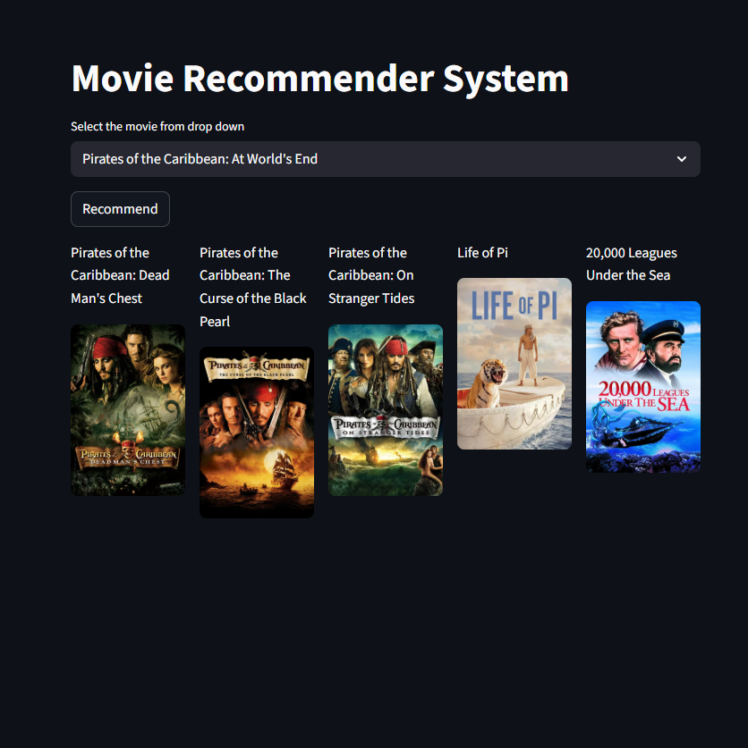

# 🎬 Movie Recommender System (Content-Based Filtering)

A Streamlit web application that recommends movies using a **Content-Based Recommendation System** built from the **TMDB 5000 Movies dataset**.  
The app suggests similar movies based on metadata features (tags) and fetches **movie posters dynamically** via the **TMDB API**.

---

## 🚀 Demo Features

- Select a movie from a dropdown
- Get Top-N similar movie recommendations
- Fetch and display posters using TMDB API
- Fast recommendations using a precomputed similarity matrix

---

## 📌 Dataset

This project uses the **[TMDB 5000 Movies Dataset](https://www.kaggle.com/datasets/tmdb/tmdb-movie-metadata)** (commonly available on Kaggle) which typically includes:

- `tmdb_5000_movies.csv`
- `tmdb_5000_credits.csv`

Key fields used in this project:
- `id` (TMDB movie id)
- `title`
- `overview`
- `genres`, `keywords`
- `cast`, `crew`

These fields are combined and transformed into a single textual feature called **tags**.

---

## 🧠 Recommendation Approach (Content-Based Filtering)

This project is a **Content-Based Recommender System**, meaning:

✅ It recommends movies that are **similar in content** to the selected movie.  
It does NOT require user ratings or user behavior.

### Steps used:
1. Combine important metadata fields into a single `tags` column
2. Text preprocessing (lowercase, stemming, remove spaces, etc.)
3. Convert tags into vectors using **CountVectorizer**
4. Compute similarity using **Cosine Similarity**
5. Recommend the top most similar movies

---

## 🔍 Types of Recommendation Systems (Quick Explanation)

### 1) Content-Based Filtering ✅ (Used in this project)
Recommends items similar to the selected item based on item features.

**Example:** If you like *Interstellar*, recommend other sci-fi/space movies.

✅ Pros:
- Works without user ratings
- Easy to explain recommendations

❌ Cons:
- Can become too narrow (similar items only)
- Needs good item metadata

---

### 2) Collaborative Filtering
Recommends items based on user behavior (ratings, clicks, watch history).

**Example:** Users who liked *Interstellar* also liked *Inception*.

✅ Pros:
- Can discover unexpected recommendations
- Works well at scale with lots of users

❌ Cons:
- Cold start problem (new users/items)
- Needs a lot of interaction data

---

### 3) Hybrid Recommendation
Combines both content-based and collaborative methods.

✅ Pros:
- Best accuracy in many real-world systems
- Solves cold start better than pure collaborative filtering

❌ Cons:
- More complex to build and maintain

---

## 📊 Evaluation

Since this project is a content-based recommender system and does not rely on user ratings, traditional accuracy metrics (RMSE, MAE) are not applicable.

The system was evaluated using:

- Qualitative inspection of recommendations
- Genre overlap between input movie and recommendations
- Precision@K using genre similarity as a relevance proxy


## 🖼️ TMDB API Integration (Posters)

The dataset contains `id` values that match TMDB movie IDs.  
For each recommended movie, the app calls TMDB API:

`GET /movie/{movie_id}`

From the response, it extracts:
- `poster_path`

Then builds the poster URL:
`https://image.tmdb.org/t/p/w500/<poster_path>`

---

## 🔐 Create [TMDB](https://developer.themoviedb.org/) API Key Secret (IMPORTANT)

This project uses a `.env` file for the TMDB API key.

### ✅ Create TMDB API Key
1. Create an account on TMDB
2. Go to API section and generate an API key

### ✅ Setup `.env`
Create a file named `.env` in the project root:

```env
TMDB_API_KEY=your_api_key_here
```
---

## How to Run?

1. create the virtual environment using requirements.txt and activate

```env
python -m venv .venv

.venv\Scripts\activate
```

2. Run the streamlit app by

```env
streamlit run app.py
```




