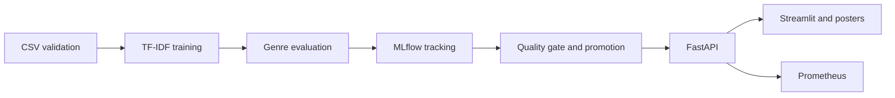

# Movie Discovery

A content-based movie recommender built with TF-IDF, FastAPI and Streamlit. I built this project to take a recommendation experiment beyond a notebook: validate the data, measure the results, track each model version and serve it through an API. The Streamlit app shows five similar movies with their posters and similarity scores.

## Recommendation method

The current pipeline represents each movie using its plot overview. It removes English stop words and extracts unigrams and bigrams into a vocabulary of up to 10,000 features. TF-IDF gives more weight to terms that distinguish one overview from the rest of the catalog.

For term $t$ in overview $d$, the weight before normalization is:

$$
w_{t,d} = \mathrm{tf}(t,d)\left[\log\left(\frac{1+N}{1+\mathrm{df}(t)}\right)+1\right]
$$

Here, $N$ is the number of movies, $\mathrm{tf}$ is the term count and $\mathrm{df}$ is the number of overviews containing that term. Each vector is L2-normalized, so its dot product with another movie vector equals cosine similarity:

$$
\mathrm{similarity}(i,j)=\frac{x_i^\top x_j}{\lVert x_i\rVert_2\lVert x_j\rVert_2}
$$

The API ranks movies by this score and excludes the selected movie. Features stay in a sparse matrix; each request computes similarity against one movie instead of storing a dense matrix of every movie pair. Genres are used only for evaluation, keeping the evaluation labels out of the input features.

## Data and results

The local TMDB catalog contained 4,803 movies. I excluded four rows with empty or whitespace-only overviews, leaving **4,799 movies**. The original CSV was preserved and the exclusions recorded in a cleaning report. Training requires unique positive IDs, nonempty titles and overviews, and valid JSON genre lists.

I evaluated the top five recommendations for 500 randomly sampled movies with genre labels, using seed 42. A recommendation counts as relevant when it shares at least one genre with the selected movie.

| Metric | TMDB result |
| --- | ---: |
| Mean genre Precision@5 | 68.92% |
| Random baseline Precision@5 | 52.16% |
| Improvement over random | 16.76 percentage points |
| Catalog coverage across evaluated queries | 37.86% |

Results are from local model `20260915T152646Z-263c8b93`, using 10,000 features. Coverage measures the fraction of the catalog that appeared at least once in the evaluated recommendations.

This evaluation measures genre consistency, not user satisfaction. Broad genres also explain why random selection scores relatively well. There is no held-out user-feedback evaluation or personalization, and lexical similarity can miss related plots written with different words. I use these results as a baseline for content retrieval.

## MLOps implementation


```mermaid
flowchart LR
    A[CSV validation] --> B[TF-IDF training]
    B --> C[Genre evaluation]
    C --> D[MLflow tracking]
    D --> E[Quality gate and promotion]
    E --> F[FastAPI]
    F --> G[Streamlit and posters]
    F --> H[Prometheus]
```

| Component | What it does in this project |
| --- | --- |
| Reproducibility | Sorted movie IDs, a fixed evaluation seed and pinned direct dependencies make runs comparable. |
| Model lineage | Each version records the input SHA-256, Git revision, parameters, Python and scikit-learn versions, and artifact hashes. |
| Experiment tracking | MLflow stores parameters, metrics and model artifacts when `--tracking-uri` is supplied. |
| Release control | Minimum precision and improvement over random determine whether a candidate can be promoted. Failed candidates retain their reports; the current model pointer stays unchanged. |
| Serving | FastAPI verifies artifact hashes at startup and returns the model version with recommendations. Promotion atomically updates `models/current.txt`; the API loads it on restart. |
| Monitoring | Prometheus records recommendation outcomes and handler latency. An offline drift check measures changes in genre distributions using total variation distance. |
| CI and containers | GitHub Actions is configured to run tests, train a gated synthetic model, upload artifacts and smoke-test the Docker Compose API. |

The reported TMDB run used the default gates: precision at least zero and improvement over random at least zero. Passing those gates confirms baseline performance; stricter release thresholds still need to be chosen. MLflow is the experiment tracker here; model versions are managed through local artifact directories. Drift checks do not trigger automatic retraining.

## Run locally

Use Python 3.12. From the project root in PowerShell:

```powershell
python -m venv .venv-win
.\.venv-win\Scripts\Activate.ps1
python -m pip install -r requirements-dev.txt
```

Place the prepared catalog at `data/tmdb_5000_movies-cleaned.csv`. Required columns are `id`, `title`, `overview` and `genres`; extra columns are ignored. CSV files and generated model artifacts are excluded from Git. The trainer rejects invalid rows rather than cleaning them automatically.

```powershell
python -m recommender.train --data data/tmdb_5000_movies-cleaned.csv --tracking-uri ./mlruns --promote
python -m uvicorn recommender.api:app --host 127.0.0.1 --port 8000
```

In a second activated terminal, run `streamlit run app.py` and open [Movie Discovery](http://localhost:8501). For posters, copy `.env.example` to `.env` and set `TMDB_API_KEY` to your TMDB API key. The app fetches poster paths by movie ID and caches the results for an hour. Recommendations still work when a poster is unavailable.

Without the TMDB CSV, generate the included 18-movie synthetic catalog with `python scripts/make_demo_data.py` and train using `--data data/demo_movies.csv`. Synthetic IDs are not TMDB IDs, so this demo does not provide meaningful posters.

## Inspect and operate

- **API:** [Interactive docs](http://localhost:8000/docs), `/movies`, `/recommendations/{movie_id}?k=5`, `/health` and `/ready`. The API accepts 1–20 recommendations.
- **Experiments:** Run `mlflow ui --backend-store-uri ./mlruns --host 127.0.0.1 --port 5000`, then open [MLflow](http://localhost:5000).
- **Tests:** Run `python -m pytest -q`. Tests cover reproducibility, validation, artifact integrity, promotion safety, recommendations, API behavior, drift and MLflow persistence.
- **Docker demo:** Run `docker compose up --build`. This trains a separate synthetic model and starts the API, UI and [Prometheus](http://localhost:9090); it does not serve the local TMDB model.
- **Model changes:** Restart the API after promotion. Restart Streamlit or clear its cache when switching catalogs.

Training and serving code live in [`recommender/`](recommender/), the UI in [`app.py`](app.py), and integration tests in [`tests/`](tests/). The original notebook and legacy pickle artifacts remain for reference; the current application uses the versioned sparse artifacts. See the [operations runbook](docs/OPERATIONS.md) for rollback, drift checks and full-catalog container serving.
